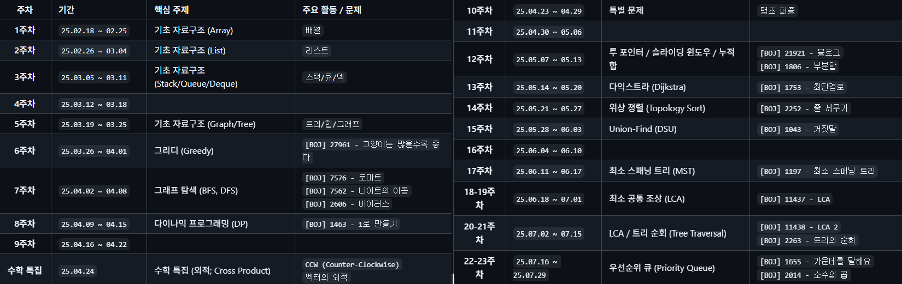
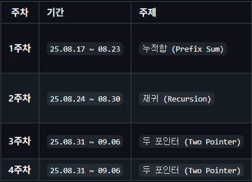
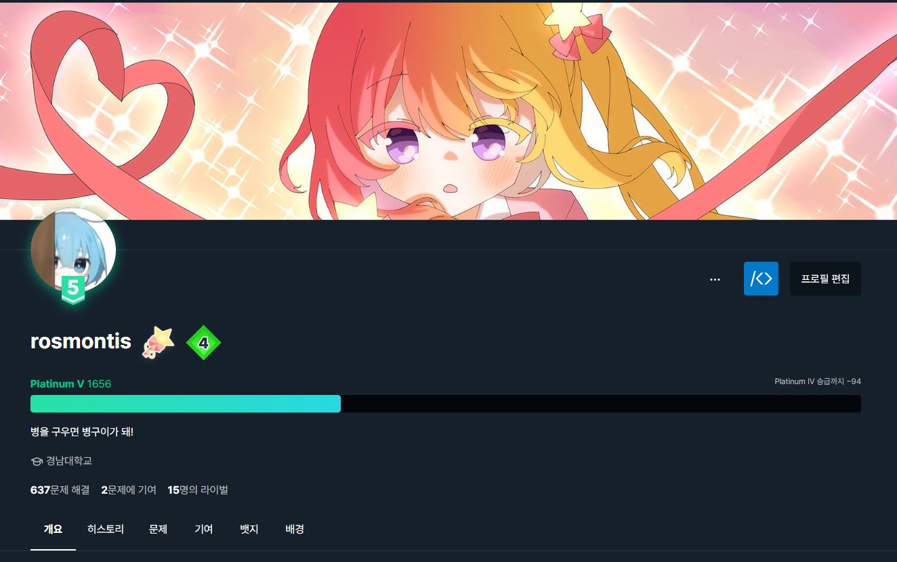
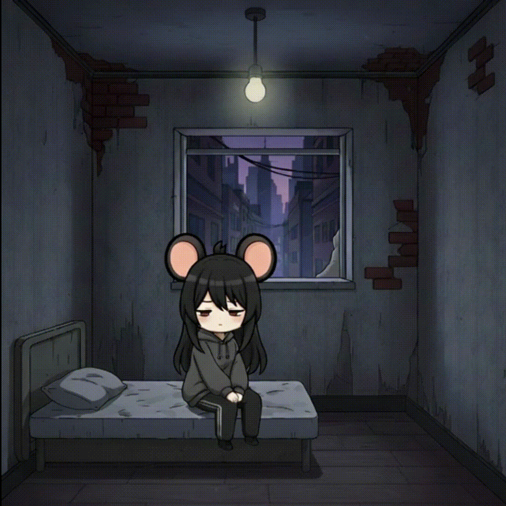
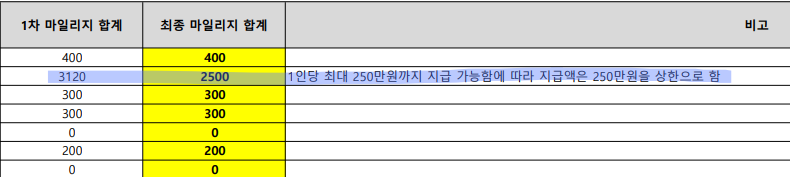
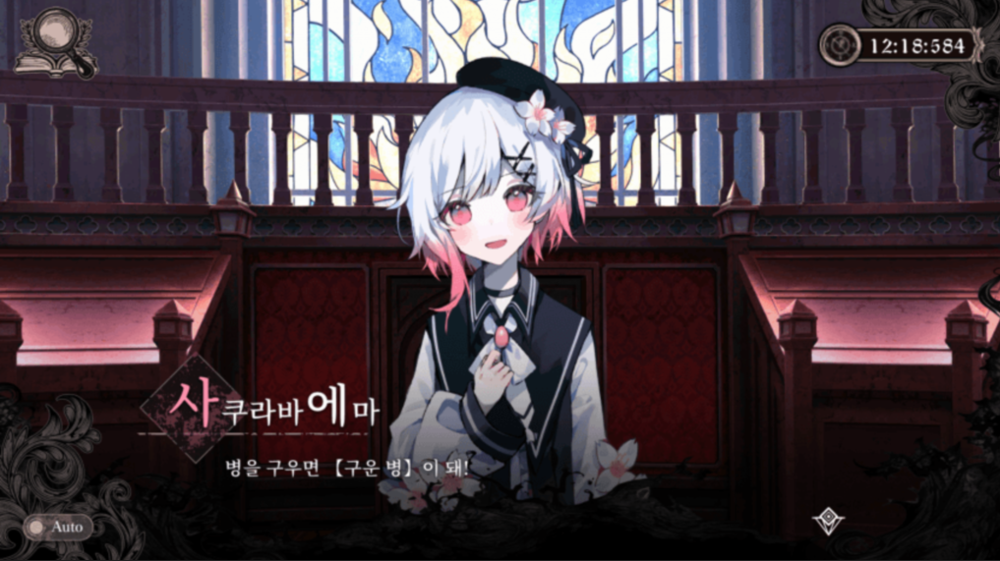

# 2025년을 보내며

미루고 미루던 블로그. 더 이상 방치하면 안 될 것 같아 2025년 회고록이라도 남겨본다. 올해는 하계부터 대외 활동과 프로젝트가 몰리면서, 1학기에 비해 2학기는 정말 빠르게 지나갔다.

## 1. 알고리즘 스터디 및 CS 공부

2025년은 CS 지식의 뿌리를 다시 단단히 하는 시기였다.

### 알고리즘 스터디와 백준 플래티넘
연초부터 알고리즘 & 자료구조 스터디에 참가했다. 실력이 뛰어난 분들을 많이 알게 되었는데, 마음속의 라이벌이자 롤모델로 삼을만한 분들을 만난 것이 가장 큰 수확이다.   
(사실 지금 블로그의 Astro 템플릿도 스터디원분 덕분에 알게 된 것이다. 여러모로 정말 감사한 분이다.)

> 
> 10월부터는 다른 활동 및 수업과 시간이 겹쳐 아쉽게도 하차하게 되었지만, 정말 유익한 시간이었다. 몇 개월이나 지치지 않고 함께 해준 스터디원분들과 스터디장님께 감사한 마음이다.

그 열정을 이어 2학기에는 교내에서 직접 알고리즘 스터디를 개설해 보기도 했다.
> 
> 야심 차게 시작했으나, 참가율 저조와 나의 주말 수업 일정이 겹치는 악재로 사실상 흐지부지되었다. 운영이란 게 쉽지 않음을 느꼈던 경험.

백준 티어는 플래티넘을 달성했다.
> 
> 티어 상승을 계기로 예전에 알던 몇몇 분들이 연락을 주시기도 했다.

### 대회 참가 기록과 아쉬움
여름 시즌에는 실력 점검 차원에서 몇몇 대회에 참가했다.

* **교내 알고리즘 대회**: 문제 난이도는 전체적으로 평이했다(3차원 BFS 정도가 변별력 문제). 하지만 진행 방식이 좀 아쉬웠다. 2회차라 그런지 규칙 공지가 미흡했고, 제출 시간이 성적에 반영되는 줄 모르고 여유 있게 제출했다가 대상을 놓치고 2위(최우수상)에 머물렀다. 다음 대회는 변별력을 위해 난이도가 조금 더 상향되었으면 좋겠다.
* **삼성 SCPC**: 1차 예선에서 1번, 3번 문제를 풀어 2솔브로 2차 진출에 성공했다. 하지만, 고질적인 밤샘 습관 때문에 2차 대회 날짜를 착각해 늦잠을 자버렸다. 문제 구경도 못 하고 불참이라니... 뼈아픈 실책이었지만, 학교에서 NYPC 성적과 합산해 장학금을 챙겨준 것으로 위안을 삼았다.
* **2025 넥슨 NYPC 대학생 코드배틀**: 요트 게임 AI를 제작하는 대회였다. 게임 AI에 대한 도메인 지식이 부족해 성적 자체는 좋지 않았으나, 룰 기반이 아닌 AI 로직을 고민해 보는 과정에서 많은 공부가 되었다.

### 그 외에 읽은 책들
네트워크, 알고리즘, 리버싱, 운영체제등.. 

## 2. 개발 및 기술 연구 (토이 프로젝트)

### AWS 인프라 비용
개인 토이 프로젝트로 **'로즈몬티스'** 캐릭터와 채팅이 가능한 웹사이트/디스코드 봇을 운영했었다. AWS EC2 기반으로 호스팅 중이었는데, 프리 티어가 만료되자 청구되는 비용이 학생 입장에서 꽤 부담스러웠다. 결국 눈물을 머금고 서버를 내렸다. 집에 있는 라즈베리파이로 마이그레이션해서 나중에 다시 살려낼 계획이다.
> 
> 디코에서 다른사람들과 대화중에 편하게 쓸 수 있어서 꽤나 애용했었다.
> 명일방주 일퀘 자동화, 일정관리, 시간측정, 녹음, 마크서버관리 등.. 잡다한 기능을 통합해 놨었다.

### 게임 엔진과 그래픽스
* **C++ Asio 분석**: 네트워크 프로그래밍의 기초를 복습하기 위해 C++ Asio 라이브러리의 공식 튜토리얼을 분석하며 비동기 I/O 모델을 학습했다.
* **Unreal Engine 5 리슨 서버 분석**: 언리얼 5의 리슨(Listen) 서버를 기준으로 제공되는 API와 서버 구조를 뜯어보았다. `GameMode`, `GameState`, `PlayerState` 같은 핵심 클래스와 RPC(Remote Procedure Call)의 작동 원리 등을 분석하고, 이를 검증하기 위한 간단한 프로젝트를 제작하며 개념을 확립했다.
* **AI × Unity 클리커 토이 프로젝트**: '나노바나나 AI'와 'Grok'을 활용해 세로 모드 클리커 게임을 만들어보았다. 원래 유니티 UI 계층 구조를 깔끔하게 설계하는 아키텍처 연습용 프로젝트였으나, 게임에 필요한 이미지 리소스들을 AI로 생성해 보면서 나노 바나나의 위력의 위력을 몸소 체감한 프로젝트였다.
> 
> 

> 귀의 움직임이 나오는게 특히나 신기했던 리소스
* **OpenGL & Shader Sandbox**: 학교 발표 과제를 계기로 OpenGL과 C++ GUI 라이브러리인 `glad`를 활용한 샌드박스 프로젝트를 진행했다. 큐브를 렌더링하고 회전시키며 쉐이더 코드, 텍스처, 조명 색상 등을 런타임에 변경하는 툴을 만들었다. 엔진이 다 해주는 걸 직접 짜보니 공부가 많이 됐다.
> 
> 빙글빙글~

## 3. 커리어 및 활동 

올해는 다양한 활동 덕분에 경제적인 부분(등록금, 생활비)을 어느정도 해결하며, 공부에 집중할 수 있는 환경을 만들 수 있었다.

### 스타트업 근무 및 연구생
* 작년말부터 여름까지 작은 스타트업에서 유니티 클라이언트 개발로 근무했다. 2학기부터는 개인 프로젝트와 깊이 있는 공부에 더 시간을 쏟고 싶어 아쉽지만 퇴사했다. 퇴사 후, 교수님의 추천으로 2학기 동안은 학생 연구원 신분으로 소속되어 있었다. 

### 영호남 대학 학술대회 (최우수상 & 리버스 엔지니어링상)
2박 3일 일정으로 참가해 프로젝트를 발표했다.
* **성과**: 최우수상과 동료 평가상인 '리버스 엔지니어링상'을 동시 수상했다. 단순한 발표가 아니라, 포스트 디펜스 형식으로 다른 참가자들과 양방향으로 소통하며 내 프로젝트를 이해시키는 과정이 꽤 즐거웠다.
* **배운 점**: PyPI 배포, AWS 및 Terraform 활용 등 인프라 지식이 확실히 늘었다.
* **에피소드**: 팀명을 명일방주의 '로즈몬티스'에서 따와 '로즈마리'로 지었으나... 아무도 못 알아봤다. 우리 팀을 제외하면 전원 4학년이었는데, 2학년 팀으로서 유의미한 상금과 성과를 거둬 뿌듯했다.

### 생산성 도구와 자격증 (GenAI)
학교 생성형 AI 수업을 통해 NotebookLM, Replit 등 다양한 툴을 익혔고, 커리큘럼에 포함된 **AWS Certified AI Practitioner** 자격증까지 취득했다.
> 
> 실무 툴 사용법도 익히고, 학교에서 자격증 취득 장학금도 챙겨주니 일석이조였다.

### 학업 성취와 장학금 해프닝
전공 변경과 복수전공으로 걱정이 많았으나, 다행히 과 수석을 차지하며 **등록금 전액 면제**를 받았다. 여기에 각종 대외 활동과 SW중심대학 마일리지까지 더해져 꽤 많은 장학금을 기대했는데...
> 
> 

학교 규정상 한 학기 최대 수혜 가능 마일리지는 2,500점이었고, 2학기에만 무려 **3,120마일리지**를 모아버린 나는 강제로 장학금이 삭감당하는(?) 웃지 못할 일을 겪었다.
결과적으로 급여, 각종 대회 상금, 그리고 (깎였지만) 넉넉한 장학금과 등록금 면제 덕분에 부모님 손을 빌리지 않고 한 해를 마무리했다. 덕분에 2026년에는 알바 걱정 없이 온전히 개발과 공부에만 몰입할 수 있는 시간을 벌어둔 것 같아 든든하다.

## 4. 코딩력 채우기

올해는 유독 비주얼 노벨 장르를 많이 즐겼다. **<활협전>, <명말천리행>, <당신과 나의 존재불명>, <마법소녀의 마녀재판>** 등... 스토리 게임들에 푹 빠져 지냈다.
특이한 점은 이런 스토리 게임의 OST를 들으면 묘하게 코딩 욕구가 솟구친다는 것이다. 벅차오르는 감정 때문인지, 몰입감 때문인지는 모르겠지만 개발 생산성에 긍정적인 도움이 된다고 믿고 있다. (단순한 자기합리화일지도 모르겠지만, 일단 나는 그렇다.)

> 
> 가장 잔인하고 상냥한 복수.
> 
> 릴리스는 존재하며
> 
> 병을 구우면 병 구이가 된다.

---

## 5. 2026년 계획

26년에는 아래와 같은 분야에 관심을 가져볼 예정이다.
- Unity NGO 프로젝트: 26년도부터 지인과 함께 유니티 NGO(Netcode for GameObjects)를 활용한 게임을 개발해 보려고 한다. 과거에 비해 유니티 네트워크 생태계가 어떻게 변했는지 직접 부딪혀보며 체험해볼 생각이다.
- UE5 공부: 최근에 공개한 언리얼의 네트워크(서버) 관련 로드맵이 심상치않다. 지금이라도 언리얼을 공부해서 UE6즈음에 서버 코드를 분석이 가능한 기초 체력을 만들어 놔야 될거 같다.
- AI 인식 변화: 2025년 2학기 GenAI수업을 통해 여러 노코드툴과 AI를 직접 접하고, 토이 프로젝트에 직접 사용해보면서 내 생각보다 AI의 발전이 매우 빠르다는걸 체감했다. 이후로는 AI툴을 적극적으로 사용하고 관련 정보를 놓치지 않도록 노력해 볼 것이다.