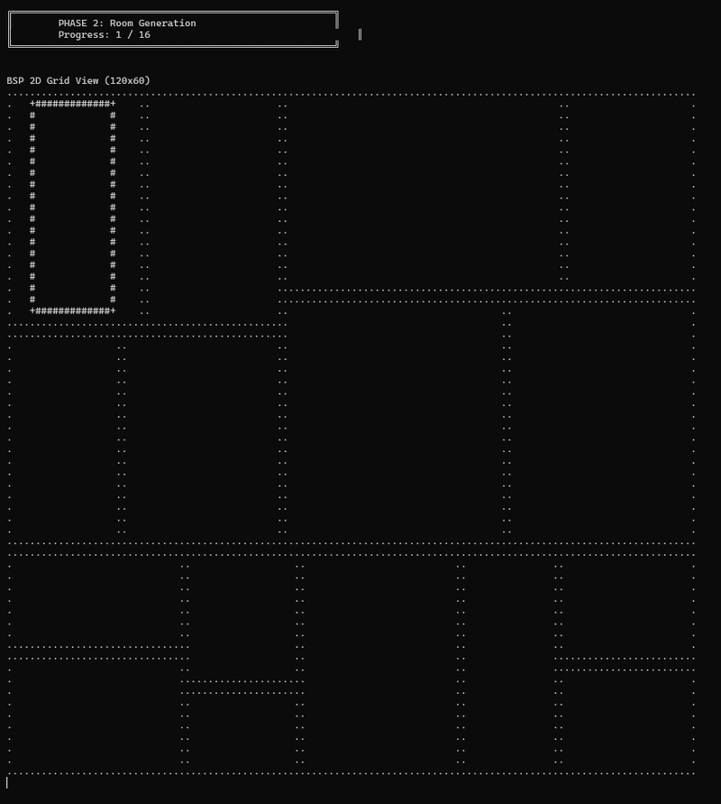
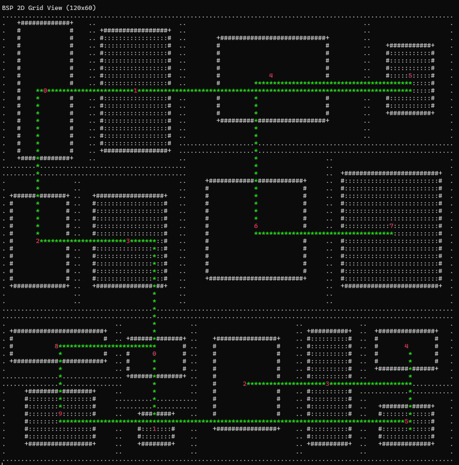

절차적 월드 생성(PCG) 시스템을 언리얼 엔진에 구현하기에 앞서, C++ 콘솔 환경에서 표준 라이브러리와 알고리즘만으로 격자형 맵을 시각화하는 테스트를 진행했다.

## 1. BSP 트리 구조체 설계

맵을 이진 공간 분할(BSP; Binary Space Partitioning)로 쪼개는 과정에서 생성되는 노드들은 메모리 관리를 용이하게 하기 위해 모던 C++의 `std::unique_ptr`를 활용하여 설계했다. (추후 언리얼 엔진으로 이식할 때 `TUniquePtr`로 대체할 예정이다.)

```cpp
struct FBSPNode
{
    FRect Area; // 할당된 전체 구역
    FRect Room; // 구역 내에 파내어질 실제 방 공간
    
    // 부모 노드 소멸 시 하위 트리의 모든 메모리가 자동 해제됨
    std::unique_ptr<FBSPNode> LeftChild;
    std::unique_ptr<FBSPNode> RightChild;
    // ...
};
```
이러한 RAII 패턴을 통해, 월드를 리셋할 때 최상단 Root 노드만 날려주면되는 안전한 구조가된다.

## 2. 결정론(Determinism) 보장과 난수 엔진 초기화 병목 해결

특정 Seed 값을 입력하면 언제나 100% 동일한 월드가 생성되는걸 본 적이 있을것이다. 이런걸 `결정론 보장`이라고 한다.      

초기 구현에서는 방의 크기나 패딩(Padding)을 연산하는 재귀 함수 내부에서 매번 난수 엔진을 생성하게 구현하였는데...

```cpp
// [개선 전] 호출마다 난수 엔진 생성 -> 결정론 보장 불가 및 CPU 병목 발생
std::random_device RandomDevice;
std::mt19937 Generator(RandomDevice()); 
int PaddingX = padX(Generator);
```

`std::mt19937`은 내부 상태가 2KB로 상대적으로 무거운편이다. 이를 재귀적으로 생성하면 오버헤드가 발생한다. 더 큰 문제로는 `random_device`를 매번 참조하므로 Seed 고정 자체가 불가능해진다.

이를 해결하기 위해 프로그램 진입점 `main`에서 1개의 전역 RNG 객체를 Seed 값과 함께 초기화하고, 모든 함수에 `std::mt19937& RNG`참조로 전달하도록 코드를 수정하였다.

## 3. 생성 함수 분리 (결합도 줄이기)

하나의 재귀 함수 내부에서 공간 분할, 방 생성, 경로 연결을 모두 처리하면 코드의 결합도가 지나치게 높아지고 유지보수가 어려워진다. 월드 생성을 3단계로 함수를 분리하였다.

1.  **`GenerateBSPTree` (공간 분할):** `Area`를 기준으로 맵을 끝까지 쪼갠다.
2.  **`GenerateRooms` (방 파내기):** 더 이상 쪼개지지 않은 말단 노드(Leaf)를 찾아, `Area` 내부에 `Padding`을 적용한 `Room`을 생성한다.
3.  **`GenerateCorridors` (경로 연결):** 방과 방 사이를 잇는 `FCorridor` 복도 데이터를 추가한다.

경로 연결을 위해 방 데이터가 기록된 무작위 `Leaf Node`를 재귀적으로 탐색해 반환하는 헬퍼 함수 `GetRandomLeaf`도 구현하였다.

```cpp
FBSPNode* LeftLeaf = GetRandomLeaf(Node->LeftChild.get(), RNG);
FBSPNode* RightLeaf = GetRandomLeaf(Node->RightChild.get(), RNG);

if (LeftLeaf && RightLeaf) 
{
    // 임시 객체 생성 비용 최소화를 위해 push_back 대신 emplace_back 사용
    OutCorridors.emplace_back(LeftCenterX, LeftCenterY, RightCenterX, LeftCenterY);
}
```

## 4. 결과 시각화 및 다음 목표

### 생성 과정 gif



> 점선(.)은 쪼개진 Area 구역을, 실선(#, +)은 실제 파내어진 Room 공간을, 별표(*)는 방과 방을 잇는 통로를 의미한다. 모든 방이 끊김 없이 연결된 것을 확인할 수 있다.

상세한 코드는 [깃허브 링크](https://github.com/heparidayo/BSPConsole/tree/master/BSPConsole)에서 확인 가능하다.    
[BSPNode.h](https://github.com/heparidayo/BSPConsole/blob/master/BSPConsole/BSPNode.h)    
[main.cpp](https://github.com/heparidayo/BSPConsole/blob/master/BSPConsole/BSPConsole.cpp)   


다음으로는 콘솔에서 테스트한 BSP 구조체를 UE5 환경에 이식해볼 것이다. `TUniquePtr`를 적용하고, 액터 스폰 대신 디버깅 라인을 활용해 3D 시각화 테스트를 진행할 예정이다.


