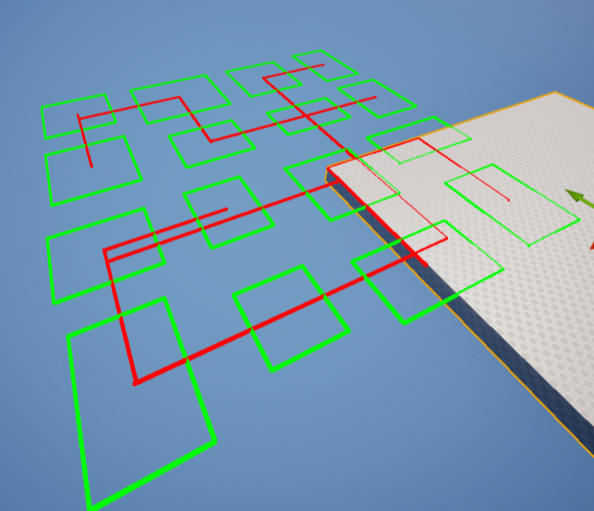
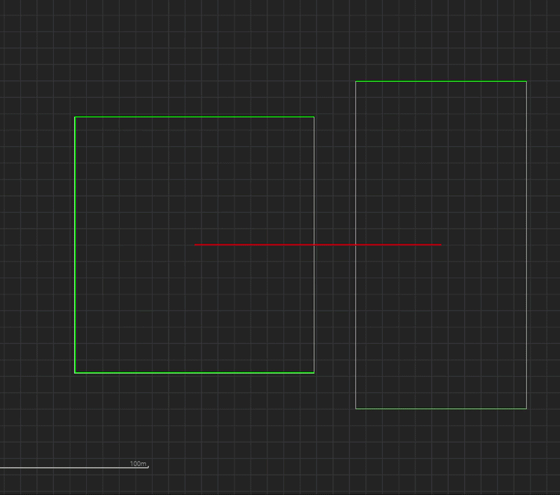
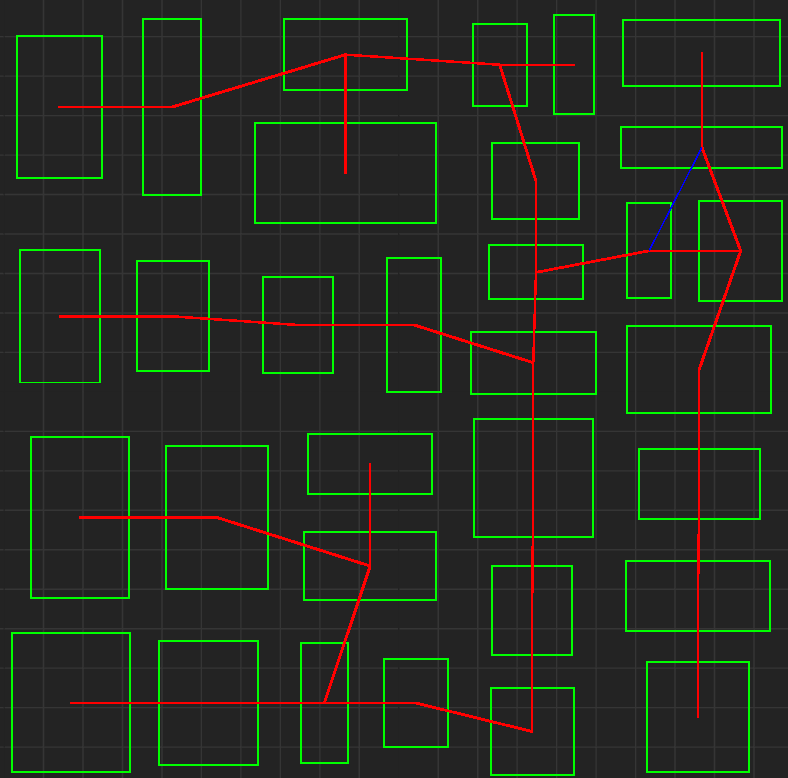

지난 3월, 순수 C++ 콘솔 환경에서 BSP 공간 분할과 데이터 구조를 테스트했다. 이번에는 해당 구조체를 언리얼 환경으로 이식하고, 단순 트리 구조였던 복도 연결을 MST를 이용해 그래프로 연결해보았다.


## 1. 언리얼 C++ 메모리 및 난수 엔진 이식

이전 C++ 콘솔 프로젝트에서 중요했던 RAII패턴(스마트 포인터), 결정론 보장, 구조체를 언리얼 환경에 맞게 수정해서 이식해야한다.

**RAII 패턴과 언리얼 GC**   
`UObject` GC 시스템이 아닌, 언리얼 Core 라이브러리(`TArray` `TUniquePtr`)를 활용해 데이터 계층의 메모리를 직접 제어 가능하게 설계해야한다.
- `std::unique_ptr` -> `TUniquePtr`
- `std::vector` -> `TArray`

**결정론 보장**   
상대적으로 무거운 C++의 메르센 트위스터 방식에서 언리얼이 제공하는 난수 구조체로 교체했다. 이제 재귀 함수가 호출될때마다 난수 엔진을 재생성하지 않고, 진입점(`OnConstruction`)에서 `FRandomStream`을 Seed로 초기화하고 참조로 넘긴다.
- `std::mt19937` -> `FRandomStream`

**네임스페이스 충돌 해결**   
UE 라이브러리에 `FEdge`와 충돌이 발생하여 간선 구조체의 이름을 수정했다.
- `FEdge` -> `FRoomEdge`


## 2. OnConstruction과 DrawDebug를 활용한 데이터 시각화

정상적으로 로직이 이식되었는지 확인하기 위해, `DrawDebug` 함수를 만들었다.

`APCGGenerator` 액터의 `OnConstruction` 함수를 오버라이드하여, 에디터 디테일 패널의 변수를 바꾸면 뷰포트의 맵 형태가 실시간으로 수정되도록 하였다.

## 3. BSP 통로의 한계 & 그래프 도입



기존 BSP 트리 구조만으로 방을 연결하면, 몇가지 거슬리는 점이 생긴다.
1. 물리적으로 바로 옆에 있는 방이라도, 트리상 멀리 떨어져 있다면 빙 돌아서 가야한다.
2. 사이클이 없어, 무조건 한번 왔던 길로만 되돌아 갈 수 있다.
   
이를 해결하기 위해, 방과 방 사이를 트리 계층과 무관하게 최단 거리로 잇는 MST를 도입했다.

## 4. Union-Find와 Kruskal 기반 MST 구현

가장 먼저 두 방이 이미 연결되었는지 판별하여 사이클을 막아주는 분리 집합 클래스 `FUnionFind`를 구현했다. 이때 탐색 최적화를 위해 경로 압축(Path Compression)을 적용하여 `Find` 연산 시간을 $O(\alpha(N))$으로 줄였다.

백준에서 문제를 풀때와는 다르게 Union by Rank 최적화는 생략하였다.

```cpp
struct FUnionFind
{
    TMap<FBSPNode*, FBSPNode*> Parent;

    // 경로 압축(Path Compression)이 적용된 Find
    FBSPNode* Find(FBSPNode* Node)
    {
        if (Parent[Node] == Node) return Node;
        return Parent[Node] = Find(Parent[Node]); 
    }
    // ... Union 함수 생략
};
```

이후 모든 말단 노드(Room) 간의 거리를 계산하여 정렬한 뒤, 크루스칼로 MST를 추출했다.

## 5. 순환로 생성

MST로 생성한 그래프는 사이클이 없어, BSP와 마찬가지로 왔던길로만 되돌아 갈 수 있다. 따라서 크루스칼 알고리즘 진행 중에 사이클을 형성하여 버려지는 간선 중 15%를 무작위(`FRandomStream`)로 부활시켜 맵에 Loop를 추가하였다.

단, 맵의 끝과 끝에 노드가 다이렉트로 연결되는 교차 간선을 막기위해, `MaxLoopDistance` (맵 전체 폭의 15%) 거리 제한을 두었다.

```cpp
if (DSU.Union(Edge.NodeA, Edge.NodeB))
{
    // 사이클이 없으면 메인 뼈대 (빨간선)
    Corridors.Emplace(X1, Y1, X2, Y2, false);
}
else
{
    // 사이클이 발생하더라도, 거리가 짧은 간선은 15% 확률로 Loop로 부활 (파란선)
    if (Edge.Distance < MaxLoopDistance && RNG.FRand() < 0.15f)
    {
        Corridors.Emplace(X1, Y1, X2, Y2, true); 
    }
}
```

## 6. 결과 시각화 및 다음 목표



> 위 이미지는 107번 시드로, 빨간선은 메인 뼈대 파란선은 Loop이다.

상세한 코드는 [깃허브 링크](https://github.com/heparidayo/UnrealPCG)에서 확인 가능하다.    


다음으로는 그래프를 기반으로 실제 물리적 배치를 위한 배열 최적화와 A* 길찾기 등을 구현해볼것이다.

