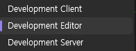
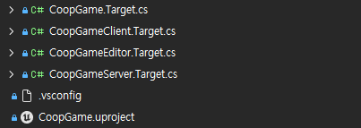

언리얼 프로젝트를 개발하기 전에 데디케이티드 서버(Dedicated Server) 구조를 상정하고 GAS(Gameplay Ability System)를 핵심 아키텍처로 가져가는 환경을 구축하던 과정을 정리하였다.

## 1. 데디케이티드 서버 빌드 타겟과 로그 설정

언리얼 엔진의 기본 템플릿은 에디터와 클라이언트 빌드만 제공한다. 서버 전용 로직을 검증하기 위해 별도의 `.Target.cs` 설정이 필요하다.

일반적으로 `Shipping` 빌드에서는 성능 최적화를 위해 모든 로그가 제거된다. 하지만 데디케이티드 서버 운영 중 발생하는 예외 상황을 추적하기 위해서는 로그가 필요하다. 이를 위해 서버 타겟 설정에서 명시적으로 로그를 활성화해야 한다.

```csharp
// CoopGameServer.Target.cs
public class CoopGameServerTarget : TargetRules
{
    public CoopGameServerTarget(TargetInfo Target) : base(Target)
    {
        Type = TargetType.Server; // 타입 Server로 변경
        DefaultBuildSettings = BuildSettingsVersion.V6;
        IncludeOrderVersion = EngineIncludeOrderVersion.Unreal5_7;

        ExtraModuleNames.Add("CoopGame");

        // 1. 서버는 당연히 Development빌드가 아니라 Shipping빌드를 한다.
        // 2. Shipping빌드는 로그가 남지 않아 디버깅이 어렵다.
        // 3. 그래서 Shipping빌드에서도 로그가 남도록 설정한다.
        bUseLoggingInShipping = true;
    }
}
```



타겟 파일을 추가하거나 수정했을 때는 반드시 `.uproject` 파일 우클릭 후 `Generate Visual Studio project files`를 실행해야 프로젝트 탐색기에 정상적으로 반영된다.

---

## 2. 버전 관리 시스템 (Git) 환경 설정

- .gitignore 설정
```git
# Unreal Engine
Binaries/
Build/
DerivedDataCache/
Intermediate/
Saved/
*.VC.db
*.opensdf
*.opendb
*.sdf
*.sln
*.suo
*.xcodeproj
*.xcworkspace

# 단, 이것들은 추적
!Config/
!Content/
!Source/
!Plugins/
!*.uproject

# Visual Studio
# .sln은 Generate Visual Studio project files로 언제든 재생성 가능하므로 추적할 필요 없다.
.vs/
*.sln
*.suo
*.user
*.userosscache
*.sln.docstates
*.VC.db
*.VC.VC.opendb

# Visual Studio Code
.vscode/

# Rider (혹시 나중에 쓸 경우 대비)
.idea/
```

- LFS (.gitattributes)

```bash
*.uasset filter=lfs diff=lfs merge=lfs -text
*.umap filter=lfs diff=lfs merge=lfs -text
*.png filter=lfs diff=lfs merge=lfs -text
*.jpg filter=lfs diff=lfs merge=lfs -text
*.fbx filter=lfs diff=lfs merge=lfs -text
*.wav filter=lfs diff=lfs merge=lfs -text
*.mp3 filter=lfs diff=lfs merge=lfs -text
*.ttf filter=lfs diff=lfs merge=lfs -text
```

---

## 3. GAS(Gameplay Ability System) 디버깅 환경

콘솔 창(`~`)에서 `ShowDebug AbilitySystem` 명령어를 입력했을 때, 현재 캐릭터가 가진 태그, 이펙트, Attribute(체력, 마나 등)을 오버레이로 확인하기 위해 `DefaultGame.ini`에 다음 설정을 추가했다.

```ini
; 콘솔 창(~ 키 입력)열고, "ShowDebug abilitysystem" 입력
; 화면에 GAS 관련 정보 (현재 가진 태그, 이펙트, 체력, 마나 등 Attribute) 오버레이 표시
[/Script/GameplayAbilities.AbilitySystemGlobals]
bUseDebugTargetFromHud=true
```

---

## 4. Enhanced Input: WASD 이동 로직 재구성

UE5의 Enhanced Input은 유연하지만, 2D Axis 기반의 입력 처리 시 축 변환(Swizzle)과 반전(Negate)의 개념을 정확히 적용해야 한다. 

엔진은 기본적으로 모든 입력을 '오른쪽(X+)' 기준으로 받는다. 따라서 `IA_Move` (Axis2D) 액션 하나로 방향을 제어하려면 다음과 같은 Modifiers 세팅이 필요하다.

* **W (위):** `Swizzle Input Axis Values` (입력을 Y축으로 변환, 이때 XYZ -> YXZ 설정 필요)
* **S (아래):** `Swizzle Input Axis Values` + `Negate` (Y축으로 변환, 이때 XYZ -> YXZ 설정 필요. 그 후 반전)
* **D (오른쪽):** 모디파이어 없음 (기본 X축 양수)
* **A (왼쪽):** `Negate` (X축 반전)

---

## 5. C++ 플레이어 캐릭터 클래스 설계

기본 템플릿의 `BP_ThirdPersonCharacter`를 재사용하거나 블루프린트 에셋 경로를 하드코딩하는 방식 대신, BP가 상속받는 기반이 되는 C++ 클래스(`ACoopGameCharacter`)를 직접 구현한다.   

카메라 세팅, 이동 컴포넌트 처리, Enhanced Input의 IMC(Input Mapping Context) 바인딩과 같은 로직은 C++에서 담당.   

이를 상속받은 BP에서는 메쉬나 애니메이션 블루프린트(AnimBP) 등 시각적 에셋만 할당하여 로직과 에셋을 분리한다.

---

> 새로운 입력(단축키, 액션 등)을 추가하는 과정을 순서대로 정리하면 아래와 같다.

1. **IA 에셋 생성:** 언리얼 에디터에서 `IA_Jump`와 같은 Input Action(IA) 에셋을 만든다.
2. **IMC 매핑:** `IMC_Default`에 생성한 IA를 추가하고 입력 키를 매핑한다. (필요시 Modifiers나 Triggers 세팅)
3. **.h 변수 노출:** 헤더(`.h`) 파일에서 `UPROPERTY`를 사용해 블루프린트에 에셋을 연결할 수 있도록 슬롯을 열어준다.
4. **.cpp 바인딩 및 구현:** 소스(`.cpp`) 파일에 실제 동작할 함수를 구현하고, `BindAction`을 통해 IA와 함수를 묶어준다.
5. **BP 할당:** C++ 클래스를 상속받은 캐릭터 블루프린트를 열고, 노출된 슬롯에 만들어둔 IMC와 IA 에셋을 할당한다.

---

이때 클래스 헤더에 컴포넌트나 에셋 참조를 선언할 때 사용하는 `UPROPERTY` 매크로는 유니티의 `[SerializeField]` 특성(Attribute)와 유사하다. 인스펙터(디테일 패널)에 변수를 노출하고 값을 직렬화하여 저장할 수 있게 해준다.

```cpp
UPROPERTY(EditAnywhere, Category = "Input")
class UInputMappingContext* DefaultMappingContext;
```

참고로 괄호 안에 `EditAnywhere` 같은 지정자(Specifier)를 넣지 않고 빈 `UPROPERTY()`만 선언하면 BP나 에디터에 노출되지 않는다. (GC에 의해 임의로 제거될 수도 있다는걸 조심하자)