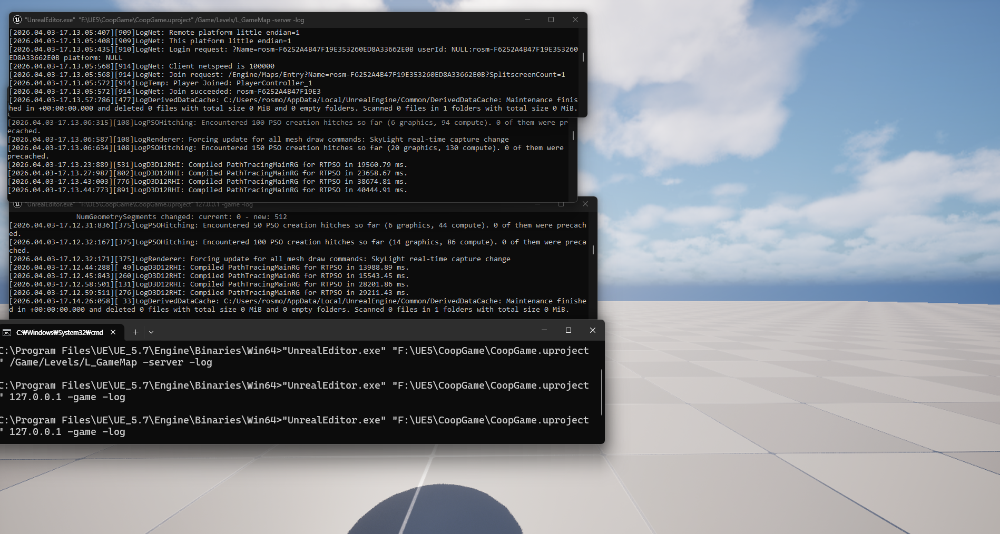

## 1. 언리얼 엔진 네트워크 모델 이해

코드 작성 전, 언리얼의 리플리케이션(Replication) 관련 개념을 일부 정리했다.

### 서버-클라이언트 구조
* **[Dedicated Server]:** 게임 로직의 모든 권위(Authority)를 가진다. 화면을 렌더링하지 않으며, 오직 게임 상태만 관리하고 이를 클라이언트에 복제(Replicate)한다.
* **[Client]:** 플레이어의 입력을 서버로 전송하고, 서버로부터 받은 상태를 화면에 렌더링하는 역할만 수행한다.

### Actor의 3가지 네트워크 역할 (Role)

| Role | 설명 | 위치 |
| :--- | :--- | :--- |
| **ROLE_Authority** | 이 Actor의 실제 주인. 핵심 로직의 실행 권한을 가짐. | 서버 |
| **ROLE_AutonomousProxy** | 로컬 플레이어가 직접 조종하는 Actor. | 클라이언트 (본인) |
| **ROLE_SimulatedProxy** | 다른 플레이어의 Actor를 복제해서 보여주는 형태. | 클라이언트 (타인) |

**예시**
```cpp
// 서버에서만 실행해야 하는 로직 (데미지 처리, 아이템 드롭 등)
if (HasAuthority()) { ... }

// 로컬 플레이어에서만 실행해야 하는 로직 (카메라 효과, HUD 등 UI 처리)
if (IsLocallyControlled()) { ... }
```

---

## 2. 주요 프레임워크 클래스 설계

네트워크 상에서 각 클래스가 어디에 존재하고 무슨 역할을 하는지 정의한다.

| 클래스 | 존재 위치 | 역할 |
| :--- | :--- | :--- |
| **AGameMode** | 서버 전용 | 게임 룰, 플레이어 입장/퇴장, 캐릭터 스폰 제어 |
| **AGameState** | 서버 + 전체 클라이언트 | 게임 전체의 상태 (타이머, 팀 점수, 접속자 수 등) |
| **APlayerState** | 서버 + 전체 클라이언트 | 개별 플레이어의 상태 (HP, 닉네임, 킬/데스 등) |
| **APlayerController** | 서버 + 해당 클라이언트 | 입력 처리 및 클라이언트-서버 간의 통신(RPC) 창구 |

### C++ 클래스 구현

**1. CoopGameMode (부모: AGameModeBase)**
플레이어의 접속 및 퇴장 로그를 서버에 기록한다.
```cpp
// CoopGameMode.cpp
#include "Core/CoopGameMode.h"
#include "Core/CoopGameState.h"
#include "Core/CoopPlayerState.h"

ACoopGameMode::ACoopGameMode()
{
    GameStateClass = ACoopGameState::StaticClass();
    PlayerStateClass = ACoopPlayerState::StaticClass();
}

void ACoopGameMode::PostLogin(APlayerController* NewPlayer)
{
    Super::PostLogin(NewPlayer);
    UE_LOG(LogTemp, Log, TEXT("Player Joined: %s"), *NewPlayer->GetName());
}

void ACoopGameMode::Logout(AController* Exiting)
{
    Super::Logout(Exiting);
    UE_LOG(LogTemp, Log, TEXT("Player Left: %s"), *Exiting->GetName());
}
```

**2. CoopGameState (부모: AGameStateBase)**
접속 중인 플레이어 수를 서버 권위로 관리하고 클라이언트에 복제한다.
```cpp
// CoopGameState.h
UPROPERTY(Replicated, BlueprintReadOnly, Category = "Game")
int32 ConnectedPlayerCount;

// CoopGameState.cpp
void ACoopGameState::GetLifetimeReplicatedProps(TArray<FLifetimeProperty>& OutLifetimeProps) const
{
    Super::GetLifetimeReplicatedProps(OutLifetimeProps);
    DOREPLIFETIME(ACoopGameState, ConnectedPlayerCount);
}
```

**3. CoopPlayerState (부모: APlayerState)**
추후 GAS(GameplayAbilitySystem)와 연동될 플레이어의 생존 여부 등을 관리한다.
```cpp
// CoopPlayerState.h
UPROPERTY(Replicated, BlueprintReadOnly, Category = "Player")
bool bIsAlive;

// CoopPlayerState.cpp
void ACoopPlayerState::GetLifetimeReplicatedProps(TArray<FLifetimeProperty>& OutLifetimeProps) const
{
    Super::GetLifetimeReplicatedProps(OutLifetimeProps);
    DOREPLIFETIME(ACoopPlayerState, bIsAlive);
}
```

**DefaultGame.ini 등록**
```ini
[/Script/EngineSettings.GameMapsSettings]
GlobalDefaultGameMode=/Script/CoopGame.CoopGameMode
```

---

## 3. 온라인 서브시스템 (OSS) 및 세션 구현

현재는 로컬 LAN 테스트를 위해 `NULL` 서브시스템을 사용하며, 추후 Steam OSS로 교체할 수 있는 구조로 설계한다.

### DefaultEngine.ini 설정
```ini
[OnlineSubsystem]
DefaultPlatformService=NULL

[OnlineSubsystemNULL]
bEnabled=true

[/Script/Engine.GameEngine]
+NetDriverDefinitions=(DefName="GameNetDriver",DriverClassName="OnlineSubsystemUtils.IpNetDriver",DriverClassNameFallback="OnlineSubsystemUtils.IpNetDriver")
```
*(에디터 Plugins에서 `Online Subsystem` 및 `Online Subsystem Utils` 활성화 필수)*

### GameInstance를 활용한 세션 관리
세션 로직은 씬 전환(Level Travel) 시에도 파괴되지 않고 살아남는 `UGameInstance`에 구현하는 것이 가장 안정적이다.

**CoopGameInstance.cpp (주요 로직 요약)**
```cpp
// 세션 생성
void UCoopGameInstance::CreateCoopSession(int32 MaxPlayers)
{
    // ... OSS 인터페이스 획득 생략 ...
    FOnlineSessionSettings SessionSettings;
    SessionSettings.bIsLANMatch = true; // NULL OSS 기준
    SessionSettings.NumPublicConnections = MaxPlayers;
    SessionSettings.bShouldAdvertise = true;
    
    SessionInterface->CreateSession(0, COOP_SESSION_NAME, SessionSettings);
}

// 세션 생성 성공 시 데디서버 레벨로 이동
void UCoopGameInstance::OnCreateSessionComplete(FName SessionName, bool bWasSuccessful)
{
    if (bWasSuccessful) {
        GetWorld()->ServerTravel("/Game/Levels/L_GameMap?listen");
    }
}

// 세션 참가 성공 시 클라이언트 이동
void UCoopGameInstance::OnJoinSessionComplete(FName SessionName, EOnJoinSessionCompleteResult::Type Result)
{
    if (Result == EOnJoinSessionCompleteResult::Success) {
        APlayerController* PC = GetFirstLocalPlayerController();
        FString TravelURL;
        if (SessionInterface->GetResolvedConnectString(SessionName, TravelURL)) {
            PC->ClientTravel(TravelURL, ETravelType::TRAVEL_Absolute);
        }
    }
}
```

---

## 4. 접속 테스트 및 검증

작성된 코드가 데디서버 환경에서 정상적으로 동작되는지 확인핮.

### 방법 1: 에디터 내 테스트 (PIE)
* **설정:** `Play As Listen Server`, `Number of Players: 2+`
* **결과:** 클라이언트 창이 2+ 개 생성되며 두 캐릭터가 동일 맵에서 동기화되는지 확인.

### 방법 2: 커맨드라인 데디서버 테스트
* **서버 실행:**
  `"UnrealEditor.exe" "[프로젝트경로]/CoopGame.uproject" /Game/Levels/L_GameMap -server -log`
* **클라이언트 실행:**
  `"UnrealEditor.exe" "[프로젝트경로]/CoopGame.uproject" 127.0.0.1 -game -log`
* **결과:** 서버 터미널에 `Player Joined` 로그가 정상적으로 출력되는지 확인.

