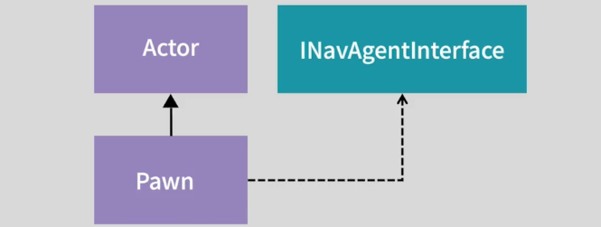
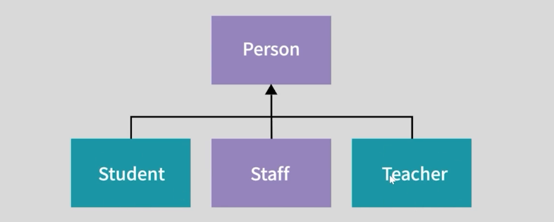

> "이득우의 언리얼 프로그래밍 Part1 - 언리얼 C++의 이해" 학습 내용을 정리한 강의 노트입니다.   
> 옵시디언에 정리한 마크다운 문서라 블로그 마크다운 양식에 일부 맞지 않을 수 있습니다.   

---

# 강의 목표
- 언리얼 C++ 인터페이스 클래스를 사용해 안정적으로 클래스를 설계하는 기법 학습

# 이론
## Interface
- 객체가 반드시 구현해야 할 행동을 지정하는 데 활용하는 타입
- 다형성(Polymorphism)의 구현, 의존성이 분리(Decouple)된 설계에 유용하게 활용

## UE 게임 콘텐츠 오브젝트 설계 예시


- 월드에 배치되는 모든 오브젝트(움직이지 않는 것도 포함) : Actor
- 움직이는 오브젝트 : Pawn
- 길찾기 시스템을 반드시 사용하면서 움직이는 오브젝트 : `INavAgentInterface` 인터페이스를 구현한 Pawn

## 언리얼 Interface 특징
- 인터페이스를 생성하면 두 개의 클래스가 생성됨
  - U로 시작하는 타입 : `UInterface` 클래스 (타입 정보 제공)  
  - I로 시작하는 Interface 타입 : `IInterface` (실질적인 설계 및 구현)-
- U타입 클래스 정보는 런타임시 인터페이스 구현 여부 파악 용으로만 사용
  - 실제로 U타입 클래스를 작업할 필요 X
- 인터페이스 구성 및 구현은 I 클래스에서 진행

# 실습

아래 클래스 구조를 직접 구현해보자.


## 1. 전 프로젝트 소스 코드 불러오기

- `UnrealInterface`라는 새 프로젝트 생성
- 외부 프로젝트에 만들어둔 `MyGameInstance.h` 와 `MyGameInstance.cpp`를 현재 프로젝트 폴더로 옮긴 후, UE에서 **Tools -> Refresh Visual Studio Project**를 하면 VS에 뜨긴 하지만 컴파일 에러가 발생
- `MyGameInstance.h` 코드 구조를 보면:

```cpp
class OBJECTREFLECTION_API UMyGameInstance : public UGameInstance

```
- 현재 프로젝트에 맞게 `_API` 매크로를 변경할 필요가 있음
  - `OBJECTREFLECTION_API` -> `UNREALINTERFACE_API`
- 언리얼 엔진이 어떤 식으로 빌드하는지는 이후 강좌에서 다룸

## 2. 클래스 설계

- Person 클래스 생성
- 상속받는 클래스 3개 생성
  - Student
  - Teacher
  - Staff

Person 객체는 생성자, getter/setter, Name 프로퍼티 보유    
**Person.h**
```cpp
UCLASS()
class UNREALINTERFACE_API UPerson : public UObject
{
	GENERATED_BODY()

public:
	UPerson();

	FORCEINLINE FString& GetName() { return Name; }
	FORCEINLINE void SetName(const FString& InName) { Name = InName; } // 복사 1회 발생

protected:
	UPROPERTY()
	FString Name;
};

```

TArray로 묶어주고 `Person`을 상속받는 객체 3개를 출력해보자.   
**MyGameInstance.cpp**

```cpp
UE_LOG(LogTemp, Log, TEXT("==============================="));
TArray<UPerson*> Persons = 
	{ NewObject<UStudent>(), NewObject<UTeacher>(), NewObject<UStaff>() };

for (const auto Person : Persons)
{
	UE_LOG(LogTemp, Log, TEXT("구성원 이름 : %s"), *Person->GetName());
}

```
**실행 결과**
```bash
LogTemp: ===============================
LogTemp: 구성원 이름 : 학생
LogTemp: 구성원 이름 : 선생님
LogTemp: 구성원 이름 : 직원
LogTemp: ==============================

```

---

## 3. 인터페이스

### 3-1. 인터페이스 정의

인터페이스를 추가해보자.
- 인터페이스를 상속받으면, 추상화 부분을 무조건 구현해야 한다.
- C++ 인터페이스는 보통 순수 가상 함수(Pure Virtual Function)로 구현을 강제하지만, 언리얼 인터페이스는 내부에 기본 함수 구현을 넣을 수도 있다.   

**LessonInterface.h**
```cpp
class UNREALINTERFACE_API ILessonInterface
{
	GENERATED_BODY()
public:
	virtual void DoLesson()
	{
		UE_LOG(LogTemp, Log, TEXT("수업에 입장합니다."));
	}
};

```

### 3-2. 인터페이스 구현 (상속 및 오버라이드)

- `Student`와 `Teacher` 클래스에 인터페이스를 상속받고 기능을 구현한다.
- `Staff`는 인터페이스를 상속받지 않는다.

**Student.h / Teacher.h**
```cpp 
UCLASS()
class UNREALINTERFACE_API UStudent : public UPerson, public ILessonInterface
{
	GENERATED_BODY()
public:
	virtual void DoLesson() override
	{
		UE_LOG(LogTemp, Log, TEXT("%s님은 수업을 듣습니다."), *Name);
	}
};

UCLASS()
class UNREALINTERFACE_API UTeacher : public UPerson, public ILessonInterface
{
	GENERATED_BODY()
public:
	virtual void DoLesson() override
	{
		UE_LOG(LogTemp, Log, TEXT("%s님은 가르칩니다."), *Name);
	}
};

```

### 3-3. 인터페이스 검사 : Cast<T>()

- `Cast<T>()`를 통해 인터페이스를 상속받고 있는지 검사가 가능하다.

**MyGameInstance.cpp**

```cpp
// 형변환으로 검사
for (const auto Person : Persons)
{
	ILessonInterface* LessonInterface = Cast<ILessonInterface>(Person);
	if (LessonInterface)
	{
		UE_LOG(LogTemp, Log, TEXT("%s님은 수업에 참여할 수 있습니다."), *Person->GetName());
		LessonInterface->DoLesson();
	}
	else
	{
		UE_LOG(LogTemp, Log, TEXT("%s님은 수업에 참여할 수 없습니다."), *Person->GetName());
	}
}

```

**실행 결과**

```bash
LogTemp: 학생님은 수업에 참여할 수 있습니다.
LogTemp: 학생님은 수업을 듣습니다.

LogTemp: 선생님님은 수업에 참여할 수 있습니다.
LogTemp: 선생님님은 가르칩니다.

LogTemp: 직원님은 수업에 참여할 수 없습니다.

```

*(참고: `DoLesson()` 내부에서 `Super::DoLesson()`을 호출하지 않았으므로 "수업에 입장합니다" 로그는 출력되지 않고 오버라이드된 로그만 출력됨. 만약, 인터페이스의 구현부 출력이 필요하면 `Super`로 추가할 것)*

# 정리

- `interface`는 클래스가 반드시 구현해야 하는 기능을 지정하는 데 사용된다.
- C++은 기본적으로 다중 상속을 지원하지만, 언리얼 C++에서는 `interface`를 사용하여 축소된 다중상속(단일 상속 + 다중 인터페이스 구현) 형태로 설계하는 것이 향후 유지보수에 유리하다.
- `interface` 생성 시 두 개의 클래스(`UInterface`, `IInterface`)가 생성된다.
- 언리얼 인터페이스는 `abstract` 타입으로 강제되지 않으며, 내부에 기본 함수 동작을 구현할 수 있다.