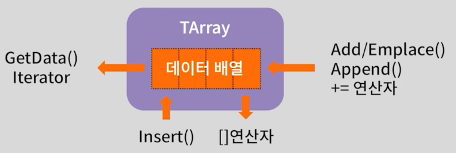
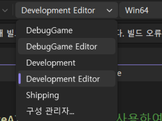
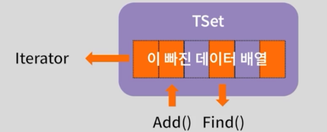

> "이득우의 언리얼 프로그래밍 Part1 - 언리얼 C++의 이해" 학습 내용을 정리한 강의 노트입니다.   
> 옵시디언에 정리한 마크다운 문서라 블로그 마크다운 양식에 일부 맞지 않을 수 있습니다.   
>

# 강의 목표
- 언리얼 대표 컨테이너 라이브러리 `TArray`, `TSet`의 내부 구조 이해
- 각 컨테이너의 장단점 파악, 알맞게 활용하는 방법 학습
    

# 언리얼 C++ 주요 컨테이너 라이브러리

`Set`과 `Map`은 C++ STL과 내부 구현 방식이 다르다.

|**STL**|**UCL**|**특징**|
|---|---|---|
|vector|TArray|순차적, 가장 빠름|
|set|TSet|중복 허용 X, 빠른 검색|
|map|TMap|키-값 쌍, 빠른 검색|

# TArray

[공식 문서: TArray](https://dev.epicgames.com/documentation/ko-kr/unreal-engine/array-containers-in-unreal-engine?application_version=5.1)

가변 배열(Dynamic Array) 자료 구조이다.

- STL의 vector와 동작 원리가 유사하다.
- 게임 제작에서 가장 효율적인 컨테이너이다.
    - 데이터가 메모리에 연속적으로 위치해 캐시 지역성(Locality) 효율이 매우 높다.
    - 임의 데이터 접근(Random Access)이 빠르다. O(1)
    - 요소 순회 속도가 가장 빠르다. O(N)
- 맨 끝에 데이터를 추가하는 것은 가볍다. (Amortized Constant)
- 단점
    - 중간 요소의 추가/삭제는 뒤의 요소들을 이동시켜야 하므로 비용이 크다. O(N)
    - 데이터가 많아질수록 검색 작업이 느려진다. O(N) (이 경우 TSet 고려)
        



## Add vs Emplace

- `Add`
    - 외부에서 객체를 생성 후, 컨테이너 내부로 복사(Copy) 혹은 이동(Move)한다.
        
- `Emplace`
    - 컨테이너 내부에서 직접 생성자를 호출하여 객체를 만든다.
    - 임시 객체 생성 및 복사/이동 비용을 절약할 수 있다.

> int와 같은 원시 타입(Primitive Type)은 차이가 없으나, 덩치가 큰 구조체나 클래스는 `Emplace` 사용을 권장한다. 효율성 측면에서 `Emplace`는 항상 `Add`보다 같거나 좋다.

## 정렬 (Sorting)

- `Sort`: 일반적인 퀵 정렬 기반 (불안정 정렬)
- `HeapSort`: 힙 정렬
- `StableSort`: 병합 정렬(Merge Sort) 기반. 요소의 상대적 순서가 유지된다.
    

## 주요 쿼리 및 기능

- `Num`: 요소 개수 반환
- `GetData`: 데이터의 원시 포인터 반환 (C 스타일 배열처럼 사용 가능)
- `operator[]`: 인덱스 접근 (유효성 검사 없음, 빠름)
- `IsValidIndex`: 특정 인덱스의 유효성 검사
- `Top`, `Last`: 마지막 요소 반환
- `Find`, `FindLast`: 요소 검색 (O(N))
- `RemoveAt`: 특정 인덱스 제거 (O(N), 뒤의 요소를 당겨옴)
- `RemoveSwap`: 제거 후 맨 끝 요소를 해당 자리로 옮김 (O(1), 순서가 중요하지 않을 때 매우 효율적)
    

## 디버깅 팁

언리얼은 기본적으로 최적화 레벨이 높아 디버깅 시 변수 값이 보이지 않을 수 있다.


```cpp
Int32Array += { 2, 4, 6, 8, 10 };
// 변수가 최적화되어 사용할 수 없습니다.
```

- 해결: 솔루션 구성을 `Development Editor (O2)` -> `DebugGame Editor(O0)`로 변경
    
- 최적화가 꺼지며(O0) 정상적으로 메모리 뷰 확인 가능

    


## 메모리 직접 제어

`AddUninitialized`로 공간만 확보하고 `FMemory::Memcpy`로 고속 복사가 가능하다.
```cpp
TArray<int32> Int32ArrayCompare;
int32 CArray[] = { 1, 3, 5, 7, 9, 2, 4, 6, 8, 10 };

// 초기화 없이 메모리 공간만 확보 (생성자 호출 안 함)
Int32ArrayCompare.AddUninitialized(ArrayNum); 
FMemory::Memcpy(Int32ArrayCompare.GetData(), CArray, sizeof(int32) * ArrayNum);
```

## 알고리즘 라이브러리

STL의 algorithm과 유사한 `Algo` 라이브러리를 제공한다.
```cpp
#include "Algo/Accumulate.h"

// 배열의 합계 계산
int32 SumByAlgo = Algo::Accumulate(Int32Array, 0); 
```

# TSet

[공식 문서: TSet](https://dev.epicgames.com/documentation/ko-kr/unreal-engine/set-containers-in-unreal-engine?application_version=5.1)

## STL set vs UE TSet

- STL `std::set`
    - 이진 트리(Red-Black Tree) 구성
    - 정렬된 상태 유지
    - 메모리가 파편화되어 있을 수 있음
    - 순회 효율이 상대적으로 낮음
        
- UE `TSet`
    - 해시 테이블(Hash Table) 기반
    - **희소 배열(Sparse Array)** 형태로 데이터 저장
    - 데이터가 비어있는 공간(Hole; Slack)이 존재할 수 있음
    - 정렬되지 않음
    - 검색 속도가 빠름 O(1)
    - 메모리가 상대적으로 모여 있어 순회 효율이 좋음
        



## 주요 특징

- 중복 없는 데이터 집합 구축에 사용
- 요소가 삭제되어도 메모리를 즉시 재할당하지 않고 `빈칸(Invalid)`으로 남겨둠
- 데이터 중간중간 비어있는 공간을 `Slack`이라 함
- `KeyFuncs`를 통해 해시 생성을 커스터마이징 가능 (이번 강의에서는 다루지 않음)
    

## 실습: 삭제 후 재추가 동작 확인

TSet은 내부적으로 희소 배열을 사용하므로, 요소 삭제 시 해당 인덱스에 플래그를 세운다.

```cpp
TSet<int32> Int32Set;
// 1~10 추가
for (int32 ix = 1; ix <= 10; ++ix) Int32Set.Add(ix);

// 짝수 제거 (2, 4, 6, 8, 10) -> 해당 인덱스는 Invalid 상태가 됨
Int32Set.Remove(2);
// ... 
Int32Set.Remove(10);

// 다시 짝수 추가
Int32Set.Add(2);
// ... 
Int32Set.Add(10);
```

## 메모리 뷰 확인

삭제된 공간(Invalid)을 재활용하여 값이 채워진다. 이때 순서는 보장되지 않으며, 빈 공간의 뒤쪽부터 채워지는 경향이 있다.   

아래 표를 보면 인덱스`[9]`에 값으로 **2**부터 채워진걸 볼 수 있다.

| 이름   | 값     | 형식   |
| ---- | ----- | ---- |
| Name | Value | Type |
| [0]  | 1     | int  |
| [1]  | 10    | int  |
| [2]  | 3     | int  |
| [3]  | 8     | int  |
| [4]  | 5     | int  |
| [5]  | 6     | int  |
| [6]  | 7     | int  |
| [7]  | 4     | int  |
| [8]  | 9     | int  |
| [9]  | **2** | int  |

# 정리
## TArray & TSet 시간 복잡도 비교

||**TArray**|**TSet**|
|---|---|---|
|접근|O(1)|O(1)*|
|검색|O(N)|O(1)|
|삽입|O(N)|O(1)|
|삭제|O(N)|O(1)|
|메모리|연속된 메모리 (빈틈없음)|희소 배열 (Invalid 존재)|
|특징|최고의 접근/순회 성능|빠른 중복 감지 및 검색|

> _TSet의 접근은 이터레이터를 통하거나 해시를 통한 조회를 의미하며, TSet을인덱스로 임의 접근하는 것은 일반적인 사용법이 아님._
>

- 게임 로직의 대부분은 `TArray`로 해결된다.
- 하지만, 빈번한 검색과 중복 방지가 필요할때는 `TSet`으로의 전환을 고려하자.