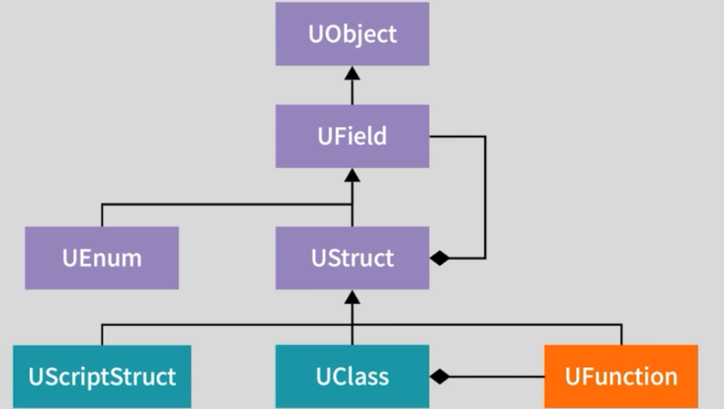
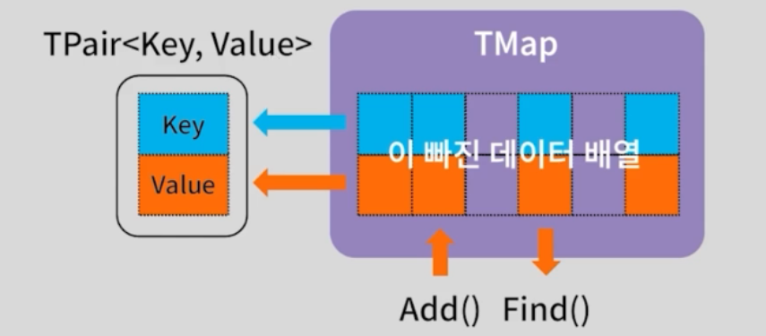

> "이득우의 언리얼 프로그래밍 Part1 - 언리얼 C++의 이해" 학습 내용을 정리한 강의 노트입니다.   
> 옵시디언에 정리한 마크다운 문서라 블로그 마크다운 양식에 일부 맞지 않을 수 있습니다.   
>

# UStruct (언리얼 구조체)

여러 변수를 하나의 묶음으로 관리할 수 있게 해주는 사용자 정의 데이터 타입.
## 특징

- **경량 객체:** 데이터 저장 및 전송에 특화되어 있으며, `UObject`보다 가볍다.
- **명명 규칙:** 언리얼 구조체의 이름은 접두사 `F`로 시작 (예: `FStudentData`).
- **리플렉션 지원 (`GENERATED_BODY`)**
    - 엔진 내부적으로는 `UScriptStruct` 클래스로 구현
- **제약 사항**
    - `UPROPERTY()`를 통해 변수(속성)는 리플렉션에 노출 가능
    - 단, `UFUNCTION()` 매크로는 사용X (블루프린트에서 호출 가능한 함수 생성 불가). C++ 멤버 함수 자체는 생성 가능
- **메모리 관리**
    - `UObject`와 달리 **가비지 컬렉터(GC)의 자동 관리를 받지 않는다.**
    - 주로 스택(Stack)에 할당하거나, 다른 클래스의 멤버 변수로 포함되어 사용
    - `NewObject<T>()` API를 사용할 수 없으며, `new` 연산자나 스택 할당을 사용

## 내부 구조 (리플렉션 계층)


- `UStruct`는 `UField`를 상속
- 내부에 `UField* Next` 포인터 등을 통해 구조체 안에 정의된 속성(Property)들을 리스트 형태로 연결하여 관리 (위 그림에 포함(composition)관계)
- **비교:** `UClass`는 함수(`UFunction`) 정보까지 포함하지만, `UScriptStruct`는 데이터만

# 실습 코드
## 구조체 & TArray 활용

**MyGameInstance.h** : 배열로 구조체 관리 예제
```cpp
#pragma once
#include "CoreMinimal.h"
#include "Engine/GameInstance.h"
#include "MyGameInstance.generated.h"

// 1. 구조체 선언
USTRUCT()
struct FStudentData
{
	GENERATED_BODY()
	
	// 기본 생성자 (리플렉션시 필요)
	FStudentData()
	{
		Name = TEXT("기본이름");
		Order = -1;
	}
	
	// 임의 생성자
	FStudentData(FString InName, int32 InOrder) : Name(InName), Order(InOrder) {}

	UPROPERTY()
	FString Name;

	UPROPERTY()
	int32 Order;
};

// 2. 클래스 선언
UCLASS()
class UNREALCONTAINER_API UMyGameInstance : public UGameInstance
{
	GENERATED_BODY()

public:
	virtual void Init() override;

private:
	// 일반 구조체 배열 (GC관리 대상 아님)
	TArray<FStudentData> StudentsData;
	
	// 언리얼 오브젝트 포인터 배열
	// TArray 내부에서 포인터를 관리할때는 UPROPERTY() 매크로 필수
	// 없으면, GC가 참조 인식을 못해 객체를 삭제함 (Dangling Pointer - 크래시!)
	UPROPERTY() 
	TArray<TObjectPtr<class UStudent>> Students;
};

```

## TArray 사용 시 주의사항

- **일반 C++ 타입 / 구조체 (`FStudentData`)**
	- `TArray`가 값 자체를 복사해서 들고 있으므로 `UPROPERTY()`가 없어도 동작에 치명적인 문제 없음 (직렬화 제외)
- **언리얼 오브젝트 포인터 (`TArray<UObject*>`)**
    - `UPROPERTY()` 매크로 필요


# TMap

## STL map vs TMap
|   **특징**   | **std::map (C++ STL)** |      **TMap (Unreal)**      |
| :--------: | :--------------------: | :-------------------------: |
|  **자료구조**  |  이진 트리 (Binary Tree)   |     해시 테이블 (Hash Table)     |
| **유사 STL** |           -            |  `std::unordered_map`과 유사   |
|   **정렬**   |     Key 기준 자동 정렬됨      |    정렬되지 않음 (입력 순서 보장 X)     |
|  **메모리**   |  노드 기반 (메모리 파편화 가능성)   | **희소 배열 (Sparse Array)** 기반 |
|   **성능**   | 검색/삽입/삭제: $O(\log N)$  |     검색/삽입/삭제: 평균 $O(1)$     |
## TMap 구조 및 특징



- **Key-Value 쌍** Key와 Value의 튜플 데이터(`TPair<Key, Value>`)를 관리
- **희소 배열 구조**
    - 데이터 삭제 시 메모리를 재할당(Realloc)하거나 당겨오지 않고, 해당 자리를 '비어있음'으로 표시
    - 이 덕분에 STL보다 **캐시 적중률(Cache Locality)**이 높고 순회 속도가 빠름
- **TMultiMap** 중복된 Key를 허용해야 할 경우 사용 (`TMap`은 Key 중복 불가능, 덮어씌워짐)


## 선언 및 사용
```cpp
// Key: int32, Value: FString
TMap<int32, FString> StudentMap;

// 데이터 추가 (기존 Key가 있으면 덮어씀)
StudentMap.Add(1, TEXT("이름1"));
StudentMap.Emplace(2, TEXT("이름2")); 
```
> `TMap`이나 `TSet`의 Key로 커스텀 구조체(`FStruct`)를 쓰려면 전역 함수 `GetTypeHash`를 반드시 오버로딩

# 시간복잡도 비교
| **구분**               | **TArray (동적 배열)** | **TSet / TMap (해시 테이블)** |
| -------------------- | ------------------ | ------------------------ |
| **인덱스 접근**           | **$O(1)$**         | 불가능                      |
| **검색 (Find)**        | $O(N)$             | **평균 $O(1)$**            |
| **삽입 (Add/Emplace)** | $O(N)$             | **평균 $O(1)$**            |
| **삭제 (Remove)**      | $O(N)$             | **평균 $O(1)$**            |
| **메모리 특징**           | 연속된 메모리 (빈틈 없음)    | 희소 배열 (중간에 빈틈 존재)        |
|                      | 순차 접근/순회에 유리       | 빠른 검색에 유리                |

