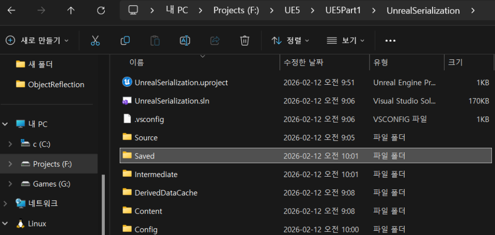

> "이득우의 언리얼 프로그래밍 Part1 - 언리얼 C++의 이해" 학습 내용을 정리한 강의 노트입니다.   
> 옵시디언에 정리한 마크다운 문서라 블로그 마크다운 양식에 일부 맞지 않을 수 있습니다.   
>


# 직렬화 (Serialization)
이전에 서버나 통신과 관련된 내용을 다뤄보았다면 익숙할 개념인 직렬화. 언리얼에서 직렬화 기능이 어떻게 제공되는지 알아보고 UObject의 데이터를 저장하고 불러들이는 방법을 실습해보자.
 
## 정의
- `직렬화(Serialization)`: 오브젝트나 오브젝트 그래프(연결된 객체들의 집합)를 디스크 저장이나 네트워크 전송이 가능한 **바이트 스트림(Byte Stream)** 형태로 변환하는 과정
- `역직렬화(Deserialization)`: 바이트 스트림을 다시 메모리 상의 오브젝트로 복구하는 과정
    
**용도**

- 게임 저장/불러오기(Save/Load)
- 멀티플레이어 네트워크 패킷 전송
- 클립보드 복사
- 데이터 압축 및 암호화
    

## 언리얼 엔진의 직렬화 시스템

언리얼은 `FArchive` 클래스와 시프트 연산자(`<<`)를 재정의하여 직렬화를 처리한다.

- **`FArchive`**: 직렬화 시스템의 최상위 추상 클래스. 
	- 파일, 메모리 등 데이터가 이동하는 '통로' 역할을 함.
    
- **`operator<<`**: 데이터의 방향을 추상화함. 
	- 로딩/저장 양쪽 모두 `Ar << Data`로 통일하여 코드를 재사용함. 
	- (아카이브 내부 상태인 `IsLoading()`, `IsSaving()`으로 구분).

---

# 실습 1: 일반 C++ 구조체(Struct) 직렬화
> 가장 기초적인 단계로, `UObject`가 아닌 일반 C++ 구조체를 바이너리 파일로 저장하고 읽어오는 방법

## 1-1. 데이터 구조체 정의 (`MyGameInstance.h`)
```cpp
struct FStudentData
{
    FStudentData() { }
    FStudentData(int32 InOrder, const FString& InName) : Order(InOrder), Name(InName) 
    { }

    // 직렬화를 위한 연산자 오버로딩 (필수)
    // FArchive를 통해 데이터를 주고받을 수 있도록 약속
    friend FArchive& operator<<(FArchive& Ar, FStudentData& InData)
    {
        Ar << InData.Order;
        Ar << InData.Name;
        return Ar;
    }

    int32 Order = -1;
    FString Name = TEXT("기본이름");
};
```
## 1-2. 저장 경로 설정 및 파일 입출력 (`MyGameInstance.cpp`)
```cpp
void UMyGameInstance::Init()
{
    Super::Init();

    // 0. 경로 설정 (Saved 폴더 활용)
    const FString SavedDir = FPaths::Combine(FPlatformMisc::ProjectDir(), TEXT("Saved"));
    const FString RawDataFileName(TEXT("RawData.bin"));
    FString RawDataAbsolutePath = FPaths::Combine(*SavedDir, *RawDataFileName);
    FPaths::MakeStandardFilename(RawDataAbsolutePath); // 경로 구분자 표준화 (경로에 / 같은거)

    FStudentData RawDataSrc(16, TEXT("홍길동")); // 데이터 만들어주고

    // 1. 쓰기 (Serialization)
    // FArchive* 
    // CreateFileWriter(*경로): 해당 경로에 쓰기 스트림을 연다.
    FArchive* FileWriterAr = IFileManager::Get().CreateFileWriter(*RawDataAbsolutePath);
    if (FileWriterAr)
    {
        *FileWriterAr << RawDataSrc; // operator<< 호출
        FileWriterAr->Close();       // 핸들 닫기 및 버퍼 플러시
        delete FileWriterAr;         // 메모리 해제
    }

    // 2. 읽기 (Deserialization)
    FStudentData RawDataDest;
    // CreateFileReader: 해당 경로의 파일을 읽기 모드로 연다.
    FArchive* FileReaderAr = IFileManager::Get().CreateFileReader(*RawDataAbsolutePath);
    if (FileReaderAr)
    {
        *FileReaderAr << RawDataDest; // 문법은 동일하나 내부적으로 읽기 동작 수행
        FileReaderAr->Close();
        delete FileReaderAr;
        
        UE_LOG(LogTemp, Log, TEXT("[RawData] 이름: %s, 순번: %d"), *RawDataDest.Name, RawDataDest.Order);
    }
}
```

```
LogTemp: 저장할 파일 폴더 : F:/UE5/UE5Part1/UnrealSerialization/Saved
LogTemp: 저장할 파일 전체 경로 : F:/UE5/UE5Part1/UnrealSerialization/Saved/RawData.bin
LogTemp: 변경할 파일 전체 경로 : F:/UE5/UE5Part1/UnrealSerialization/Saved/RawData.bin
```

실제 경로    
`F:\UE5\UE5Part1\UnrealSerialization`


---

# 실습 2: 언리얼 오브젝트(UObject) 직렬화
> `UObject`는 자체적으로 `Serialize` 함수를 가진다. 이를 활용해 객체를 **메모리(Buffer)** 로 먼저 직렬화한 뒤, 그 버퍼를 **파일**로 저장하는 2단계 방식을 주로 사용한다. (네트워크 전송 등을 고려한 패턴)


## 2-1. 메모리 아카이브 활용
- `FMemoryWriter`: 객체 -> 메모리(`TArray<uint8>`)
- `FMemoryReader`: 메모리(`TArray<uint8>`) -> 객체

```cpp
// UStudent* StudentSrc 객체가 생성되어 있다고 가정 (Order: 59, Name: 홍길동)

// 1. 저장 (Object -> Memory -> File)
const FString ObjectDataFileName(TEXT("ObjectData.bin"));
FString ObjectPath = FPaths::Combine(*SavedDir, *ObjectDataFileName);
FPaths::MakeStandardFilename(ObjectPath);

TArray<uint8> BufferArray; // 직렬화된 데이터가 담길 임시 메모리 공간

// A. 메모리에 쓰기
FMemoryWriter MemoryWriterAr(BufferArray); 
StudentSrc->Serialize(MemoryWriterAr); // UStudent의 Serialize 함수 호출

// B. 파일에 쓰기 (TUniquePtr 활용으로 delete 생략)
if (TUniquePtr<FArchive> FileWriterAr = TUniquePtr<FArchive>(IFileManager::Get().CreateFileWriter(*ObjectPath)))
{
    *FileWriterAr << BufferArray; // TArray<uint8> 자체를 파일에 기록
    FileWriterAr->Close();
}

// 2. 불러오기 (File -> Memory -> Object)
TArray<uint8> BufferArrayFromFile;

// A. 파일에서 읽어오기
if (TUniquePtr<FArchive> FileReaderAr = TUniquePtr<FArchive>(IFileManager::Get().CreateFileReader(*ObjectPath)))
{
    *FileReaderAr << BufferArrayFromFile; // 파일 내용을 버퍼로 전송
    FileReaderAr->Close();
}

// B. 메모리 내용을 오브젝트에 복구
FMemoryReader MemoryReaderAr(BufferArrayFromFile);
UStudent* StudentDest = NewObject<UStudent>();
StudentDest->Serialize(MemoryReaderAr); // 버퍼 내용을 StudentDest에 주입
```

---

# 실습 3: JSON 직렬화
> 데이터를 텍스트 기반 JSON 포맷으로 변환. 웹 서버 통신이나 데이터 디버깅 용으로 주로 사용

## 3-1. 사전 준비
- 모듈 추가: `ProjectName.Build.cs` 파일에 `Json`, `JsonUtilities` 모듈을 추가해야 컴파일 링크 에러가 발생하지 않는다.

```cs
PublicDependencyModuleNames.AddRange(new string[] { "Core", "CoreUObject", "Engine", "InputCore", "EnhancedInput" , "Json", "JsonUtilities"});
```
- 헤더추가: `#include "JsonObjectConverter.h"`


## 3-2. JSON 변환 흐름
**[UObject]** ↔ (Converter) ↔ **[FJsonObject]** ↔ (Serializer) ↔ **[String]**

```cpp
// 1. 저장 (UObject -> JsonObject -> String -> File)
const FString JsonFileName(TEXT("StudentJsonData.txt"));
FString JsonPath = FPaths::Combine(*SavedDir, *JsonFileName);
FPaths::MakeStandardFilename(JsonPath);

// A. UObject -> JsonObject 변환
// MakeShared: TSharedRef 생성 (스마트 포인터)
TSharedRef<FJsonObject> JsonObjectSrc = MakeShared<FJsonObject>();
FJsonObjectConverter::UStructToJsonObject(StudentSrc->GetClass(), StudentSrc, JsonObjectSrc);

// B. JsonObject -> String 변환 (직렬화)
FString JsonOutString;
// TJsonWriter: 문자열에 JSON 형식을 쓸 수 있는 라이터 생성
TSharedRef<TJsonWriter<TCHAR>> JsonWriterAr = TJsonWriterFactory<TCHAR>::Create(&JsonOutString);

if (FJsonSerializer::Serialize(JsonObjectSrc, JsonWriterAr))
{
    // C. String -> File 저장
    FFileHelper::SaveStringToFile(JsonOutString, *JsonPath);
}

// 2. 불러오기 (File -> String -> JsonObject -> UObject)
FString JsonInString;

// A. File -> String 로드
if (FFileHelper::LoadFileToString(JsonInString, *JsonPath))
{
    // B. String -> JsonObject 파싱 (역직렬화)
    TSharedRef<TJsonReader<TCHAR>> JsonReaderAr = TJsonReaderFactory<TCHAR>::Create(JsonInString); // Json 리더 객체 생성
    TSharedPtr<FJsonObject> JsonObjectDest;
    if (FJsonSerializer::Deserialize(JsonReaderAr, JsonObjectDest))
    {
        // C. JsonObject -> UObject 변환
        UStudent* JsonStudentDest = NewObject<UStudent>();

        // JsonObjectToUStruct(변환할원본JSON, 변환대상의타입정보(reflection), 데이터넣을객체)
        if (FJsonObjectConverter::JsonObjectToUStruct(JsonObjectDest.ToSharedRef(), JsonStudentDest->GetClass(), JsonStudentDest))
        {
            // 성공 시 로직 처리 ex.
            PrintStudentInfo(JsonStudentDest, TEXT("JsonData")); // 단순 정보 출력용
        }
    }
}
```

---

# 언리얼 스마트 포인터 라이브러리
> C++ 표준(`std::shared_ptr` 등) 대신 언리얼 엔진 자체적으로 제공하는 스마트 포인터를 사용해야 한다.

| **타입**           | **특징**                                      | **사용 예시**                                             |
| ---------------- | ------------------------------------------- | ----------------------------------------------------- |
| **`TUniquePtr`** | 유일한 소유권. 복사 불가, 이동만 가능. 스코프를 벗어나면 자동 해제.    | 파일 핸들러(`FArchive`)처럼 사용 후 반드시 닫아야 하는 임시 객체 관리.        |
| **`TSharedPtr`** | 공유 소유권. 레퍼런스 카운팅 방식. null 허용.               | 여러 클래스에서 데이터를 공유할 때.                                  |
| **`TSharedRef`** | `TSharedPtr`와 유사하나 **유효한 객체(Not Null)** 보장. | 반드시 유효한 객체가 필요한 엔진 함수 인자 (예: `FJsonObjectConverter`). |

# 정리

### 1. 연산자 `<<`의 양방향성
- **개념:** `Ar << Data` 코드는 저장(Write)과 로딩(Read)을 모두 수행
- **핵심:** `<<` 연산자는 `FArchive`의 내부 상태(`IsLoading()`, `IsSaving()`)에 따라 데이터의 흐름 방향을 스스로 결정. 덕분에 저장 함수와 로딩 함수를 따로 만들지 않고 **하나의 코드로 관리**할 수 있다.

### 2. 일반 구조체 vs UObject의 직렬화 차이
- **일반 C++ 구조체:** `friend FArchive& operator<<` 오버로딩을 직접 구현하여, 아카이브가 구조체 내부 데이터를 순회하는 방법을 알려줘야한다. (혹은 데이터를 넣는 순간에 직접 하나하나 넣거나..)
- **UObject:** 객체를 바로 파일에 쓰지 않는다. `FMemoryWriter`를 사용해 메모리 버퍼(`TArray<uint8>`)로 먼저 변환한 뒤, 그 버퍼를 파일에 저장하는 **2단계 방식**을 주로 사용

### 3. JSON 사용 시 필수 설정 (Build.cs)
- **개념:** JSON 기능은 언리얼 엔진의 코어 모듈에 포함 X
- **주의:** 코드를 완벽하게 작성해도 컴파일 시 `LNK2019` 같은 링킹 에러가 발생한다면, 높은 확률로 `Build.cs` 파일에 모듈 설정이 누락된 것
- **해결:** `PublicDependencyModuleNames`에 `"Json"` `"JsonUtilities"`를 반드시 추가

### 4. 스마트 포인터 `TUniquePtr`의 활용
- **개념:** 파일 입출력(I/O)은 '열기(Open) → 쓰기/읽기 → 닫기(Close)'의 과정이 필수
- **핵심:** 파일 핸들(`FArchive*`)을 `TUniquePtr`로 감싸서 관리하면, 함수가 종료되거나 예외가 발생하더라도 소멸자가 자동으로 호출되어 파일을 안전하게 닫아준다. (RAII 패턴)

### 5. 바이너리 vs JSON의 용도 구분
- **바이너리(Binary):** 용량이 작고 속도가 빠름. 보안이 중요함.
    * **게임 저장 데이터(SaveGame), 네트워크 패킷 전송**에 사용
- **JSON:** 텍스트 기반이라 사람이 읽고 수정하기 쉬움(가독성). 용량이 큼.
    * **기획 데이터 테이블 관리, 웹 서버 통신(API), 설정 파일**에 사용

---

# AI 생성 챕터 질문

아래 질문에 보지 않고 대답할 수 있다면 이 챕터를 완벽하게 이해한 것입니다.

**Q1. 구조체 `FStudentData`를 직렬화 하려는데 `operator<<`를 정의하지 않으면 어떻게 됩니까?**
<details>
<summary>정답 확인 (클릭)</summary>
<div markdown="1">
컴파일 에러가 발생합니다. 컴파일러는 해당 구조체의 어떤 멤버 변수를 어떤 순서로 바이트 스트림으로 변환해야 할지 알 수 없기 때문에, 개발자가 직접 연산자 오버로딩을 통해 직렬화 규칙을 정의해 주어야 합니다.
</div>
</details>

<br>

**Q2. 네트워크로 데이터를 보낼 때 JSON 대신 바이너리 직렬화를 쓰는 가장 큰 이유는 무엇입니까?**
<details>
<summary>정답 확인 (클릭)</summary>
<div markdown="1">
데이터 크기(용량)와 처리 속도 때문입니다. JSON은 텍스트 기반이라 데이터 크기가 크고 파싱 비용이 비싼 반면, 바이너리는 데이터를 압축된 형태 그대로 보내므로 트래픽을 줄이고 빠르게 전송할 수 있습니다.
</div>
</details>

<br>

**Q3. 파일 경로를 `C:\\MyGame\\Saved` 처럼 문자열로 하드코딩하면 안 되는 이유는 무엇이며, 대신 무엇을 써야 합니까?**
<details>
<summary>정답 확인 (클릭)</summary>
<div markdown="1">
운영체제(Windows, Mac, Linux, Console 등)마다 파일 경로 구분자(`/` 또는 `\`)나 파일 시스템 구조가 다르기 때문입니다. 대신 `FPaths::Combine()` 함수와 `FPlatformMisc::ProjectDir()` 등을 사용하여, 엔진이 실행 중인 플랫폼에 맞춰 경로를 자동으로 생성하도록 해야 합니다.
</div>
</details>