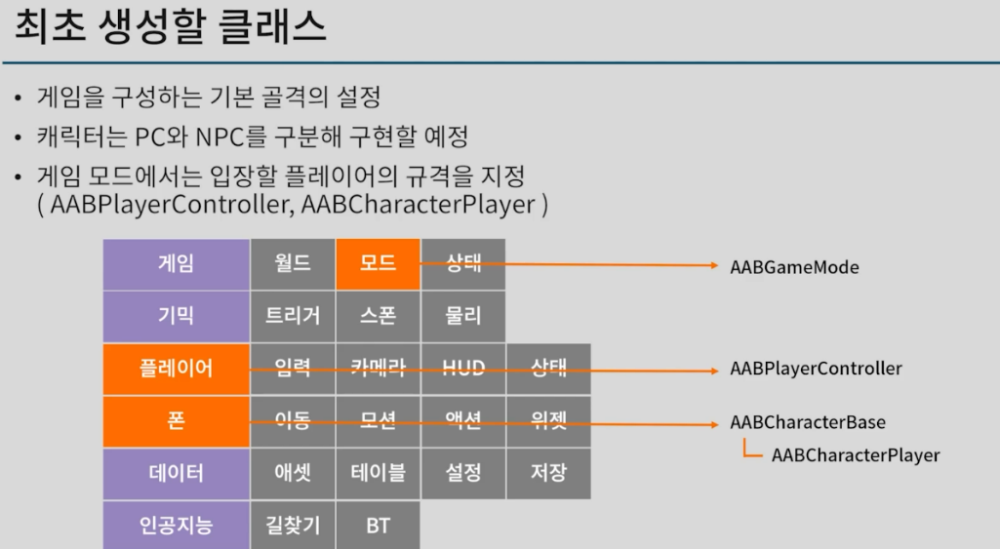
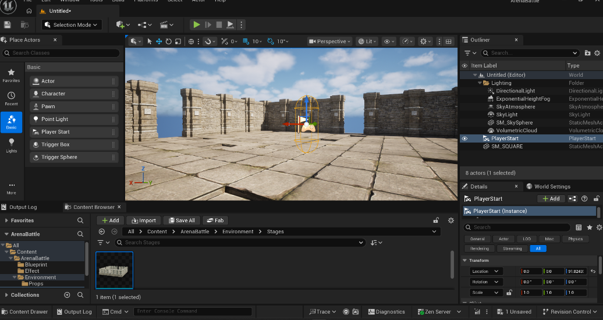
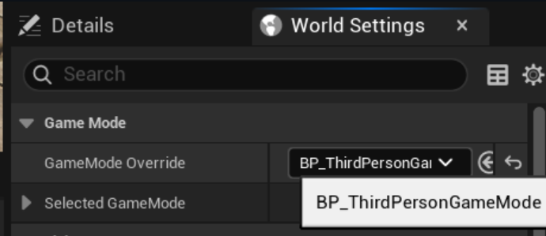
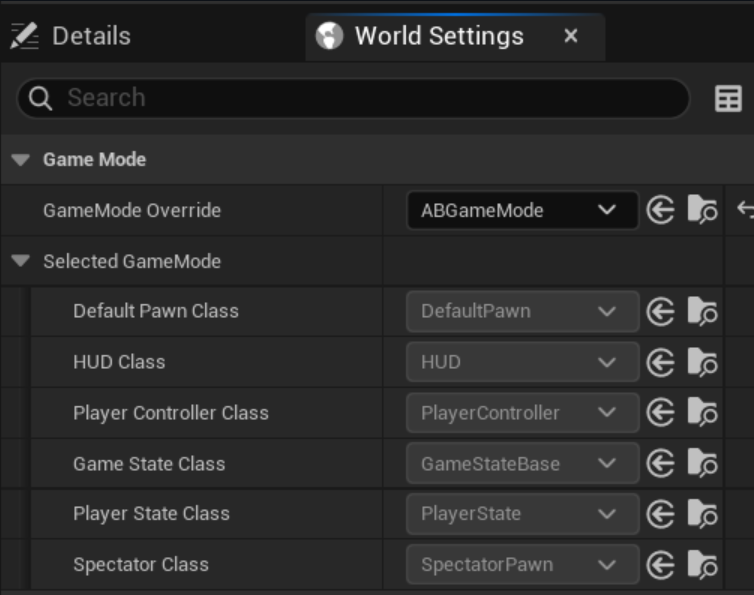
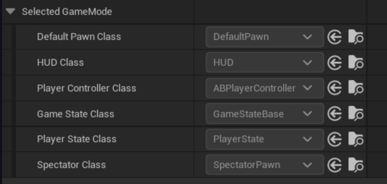

### 1. 강의 요약

* 게임 콘텐츠 구조 및 프레임워크 구성 요소 이해
* 단순한 구조에서 복잡한 구조로 확장하는 게임 제작 과정 숙지
* C++ 프로젝트 구성을 위한 기본 설정
* **헤더 참조 최소화 설계:** 게임 구성 요소를 폴더별로 분류하고, 타 클래스의 헤더 파일 Include를 최소화하기 위해 `ConstructorHelpers::FClassFinder`를 활용하여 에셋을 로드하는 규칙 수립.

### 2. 구조 설계 및 결합도 관리 (인터페이스 활용)

* **문제점:** `Characters` 폴더의 `PlayerCharacter`와 `Weapons` 폴더의 `Gun` 클래스가 직접 참조할 경우, 두 폴더 및 모듈 간의 강결합(Tight Coupling)이 발생함.
* **해결책:** `ICharacterWeaponUser`와 같은 인터페이스를 정의하여 클래스 간의 결합도를 낮추는(Loose Coupling) 유연한 구조로 설계.

### 3. 클래스 구성 및 에디터 팁

이번 강의에서 구성하는 프레임워크 클래스 구조는 다음과 같음.

* **GameMode:** `AABGameMode`
* **PlayerController:** `AABPlayerController`
* **Pawn:** `AABCharacterBase` ➡ `AABCharacterPlayer`

**에디터 팁:** 맵에 `Player Start` 액터를 배치할 때 `End` 키를 누르면 바닥에 자동으로 스냅된다.


---

### 4. 코드 구현: GameMode (헤더 의존성 제거)

프로젝트 세팅에서 기본 게임 모드를 `ABGameMode`로 변경. 


블루프린트 에셋을 C++ 코드에서 직접 로드하여 다른 클래스의 헤더 파일을 Include 하는 것을 방지함.

* **주의:** `FClassFinder`로 블루프린트 클래스 정보를 가져올 때는 에셋 경로 마지막에 반드시 `_C`를 붙여야 클래스로 인식됨.

**`ABGameMode.h`**

```cpp
#pragma once

#include "CoreMinimal.h"
#include "GameFramework/GameModeBase.h"
#include "ABGameMode.generated.h"

UCLASS()
class ARENABATTLE_API AABGameMode : public AGameModeBase
{
	GENERATED_BODY()

public:
	AABGameMode();
};

```

**`ABGameMode.cpp`**

```cpp
#include "Game/ABGameMode.h"

AABGameMode::AABGameMode()
{
	// 1. 플레이어 컨트롤러 설정 (헤더 의존성 제거)
	static ConstructorHelpers::FClassFinder<APlayerController> PCRef(
		TEXT("/Game/ThirdPerson/Blueprints/BP_ABPlayerController.BP_ABPlayerController_C"));
	if (PCRef.Class)
	{
		PlayerControllerClass = PCRef.Class;
	}

	// 2. 기본 폰(캐릭터) 설정
	static ConstructorHelpers::FClassFinder<APawn> ThirdPersonClassRef(
		TEXT("/Game/ThirdPerson/Blueprints/BP_ThirdPersonCharacter.BP_ThirdPersonCharacter_C"));
	if (ThirdPersonClassRef.Class)
	{
		DefaultPawnClass = ThirdPersonClassRef.Class;
	}
}

```

---

### 5. 코드 구현: PlayerController (향상된 입력 설정)

게임 시작 시점에 플레이어의 입력 방식을 게임 전용으로 고정하고, Enhanced Input(향상된 입력) 시스템의 매핑 컨텍스트를 활성화함.



**`ABPlayerController.h`**

```cpp
#pragma once

#include "CoreMinimal.h"
#include "GameFramework/PlayerController.h"
#include "EnhancedInputSubsystems.h"
#include "ABPlayerController.generated.h"

UCLASS()
class ARENABATTLE_API AABPlayerController : public APlayerController
{
	GENERATED_BODY()

public:
	virtual void BeginPlay() override;

protected:
	UPROPERTY(EditDefaultsOnly, Category = "Input")
	TObjectPtr<const UInputMappingContext> DefaultMappingContext;
};

```

**`ABPlayerController.cpp`**

```cpp
#include "Player/ABPlayerController.h"
#include "EnhancedInputSubsystems.h"
#include <Engine/LocalPlayer.h>

void AABPlayerController::BeginPlay()
{
	Super::BeginPlay();

	// 게임이 시작될 때, 입력 모드를 게임 전용으로 설정 (마우스 커서 숨김 및 뷰포트 포커스)
	FInputModeGameOnly GameOnlyInputMode;
	SetInputMode(GameOnlyInputMode);

	// 향상된 입력 로컬 플레이어 서브시스템을 통해 매핑 컨텍스트 추가
	if (ULocalPlayer* LP = GetLocalPlayer())
	{
		if (UEnhancedInputLocalPlayerSubsystem* Subsystem = LP->GetSubsystem<UEnhancedInputLocalPlayerSubsystem>())
		{
			if (DefaultMappingContext)
			{
				Subsystem->AddMappingContext(DefaultMappingContext, 0);
			}
		}
	}
}

```


